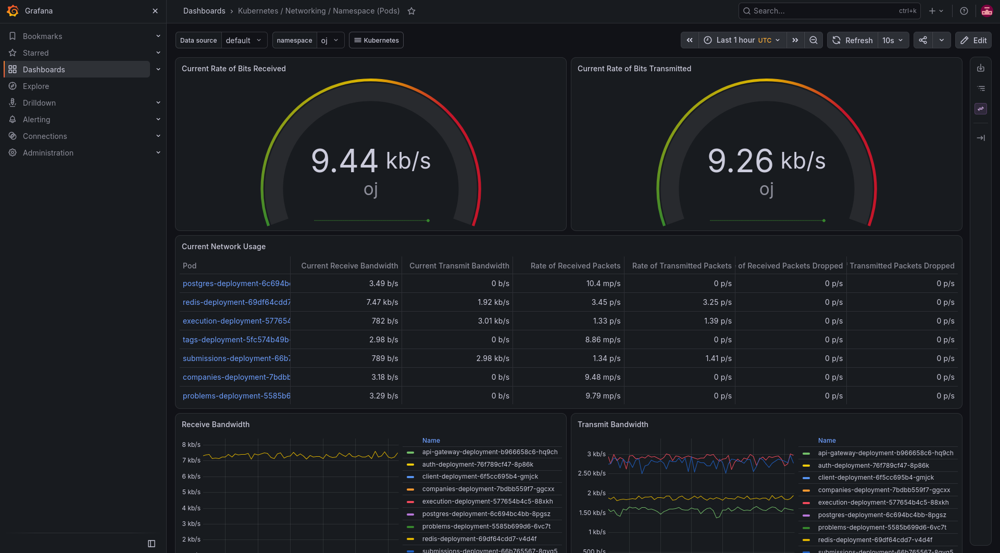
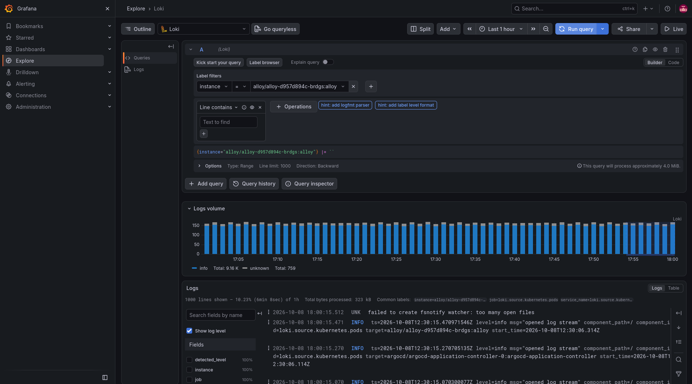
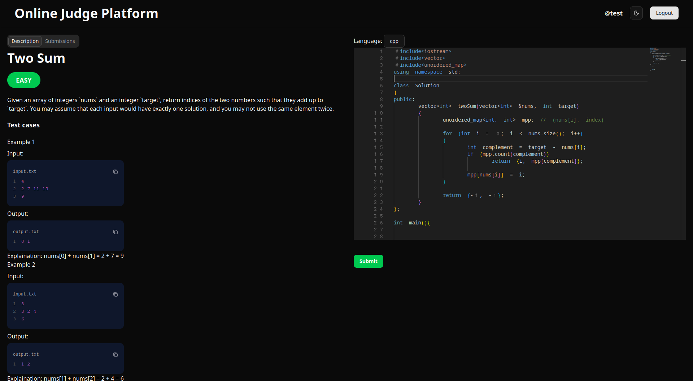
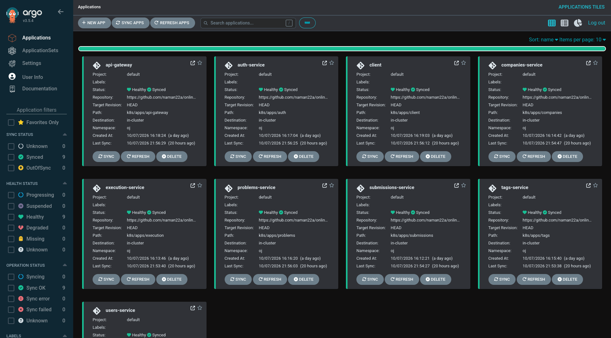

# 🏠 Homelab

An infrastructure-as-code repository for my personal homelab.

Currently, this repository manages one server: `think-server`, a ThinkPad T480 running Ubuntu Server. The configuration is managed primarily through Ansible, with Kubernetes workloads running on k3s.

## 🏗️ Architecture

```text
                         Internet
                            │
                     Cloudflare Tunnel
                            │
                            ▼
                    ┌───────────────┐
                    │  think-server │
                    └───────┬───────┘
                            │
                     ┌──────▼──────┐
                     │    k3s      │
                     │  Kubernetes │
                     └──────┬──────┘
                            │
                     ┌──────▼──────┐
                     │   Traefik   │
                     │   Ingress   │
                     └──────┬──────┘
                            │
              ┌─────────────┴─────────────┐
              │                           │
              ▼                           ▼
     judge.namanarora.xyz       argocd.namanarora.xyz
              │                           │
              ▼                           ▼
       Online Judge                    Argo CD
          `oj`                         `argocd`
```

Private administration is handled through Tailscale SSH.

## ⚙️ Hardware


## 🚕 Services

| Service                   | Purpose               | Access           |
| ------------------------- | --------------------- | ---------------- |
| **Homarr**                | Homelab dashboard     | LAN / Cloudflare |
| **Portainer**             | Docker management     | LAN              |
| **Jellyfin**              | Media server          | LAN / Cloudflare |
| **Immich**                | Photo management      | LAN / Cloudflare |
| **Argo CD**               | GitOps / Kubernetes   | Cloudflare       |
| **Online Judge**          | Kubernetes workload   | Cloudflare       |
| **Samba**                 | Network file sharing  | LAN              |
| **Tailscale**             | Private remote access | Tailscale        |
| **Cloudflared**           | Public service tunnel | Outbound         |
| **k3s**                   | Kubernetes            | LAN              |
| **Traefik**               | Kubernetes ingress    | LAN / Cloudflare |
| **GitHub Actions Runner** | CI/CD                 | Outbound         |

## 🌐 Server

- **Host:** ThinkPad T480 (`think-server`)
- **OS:** Ubuntu Server 26.04
- **Kubernetes:** k3s `v1.36.5+k3s1`
- **Configuration:** Ansible

The server is intended to be managed through Ansible rather than manually configured wherever practical.

## 🚧 Repository Structure

```text
.
├── ansible
│   ├── ansible.cfg
│   ├── requirements.yml
│   ├── inventory
│   │   ├── group_vars
│   │   │   └── all
│   │   │       └── vault.yml
│   │   ├── hosts.ini
│   │   ├── playbooks
│   │   │   └── think-server.yml
│   │   └── roles
│   │       ├── argocd
│   │       ├── cloudflared
│   │       ├── docker
│   │       ├── github_runner
│   │       ├── homarr
│   │       ├── immich
│   │       ├── jellyfin
│   │       ├── k3s
│   │       ├── portainer
│   │       ├── samba
│   │       ├── tailscale
│   │       └── ufw
└── README.md
```

## 🍁 Ansible

The server is configured through modular Ansible roles.

```bash
cd ansible
ansible-playbook playbooks/think-server.yml --vault-password-file .vault_pass
```

Secrets that need to be available to Ansible are stored in: `group_vars/vault.yml`

The file is encrypted using Ansible Vault.

## 🌐 Remote Access

- **Tailscale** — private SSH access
- **Cloudflare Tunnel** — public exposure without directly exposing the server

Public traffic is routed through Cloudflare → Traefik → Kubernetes services.

## 🟣 Kubernetes

### k3s

The server runs a single-node k3s cluster.

```text
think-server
└── k3s
    ├── Traefik
    ├── Online Judge
    └── Argo CD
```

The node is configured as the control-plane node.

### Traefik

Traefik is the ingress controller provided by the k3s installation.

It receives traffic on:

- 80
- 443

The Online Judge and Argo CD services are routed through Traefik.

## 📊 Monitoring

The cluster is monitored using Prometheus and Grafana.



### Centralized Logging

Kubernetes pod logs are collected using Grafana Alloy and stored in Loki.



## 👨‍⚖️ Online Judge

The main Kubernetes workload is my Online Judge Platform.



Repository: https://github.com/naman22a/online-judge-platform

It runs in the: `oj` namespace.

The platform consists of multiple NestJS backend services, PostgreSQL, Redis and a React frontend.

The execution service creates Kubernetes Jobs for submitted code, with resource limits and timeouts.

## 🐋 Docker

Docker is managed through Ansible and is used for non-Kubernetes services such as Portainer and other homelab workloads.

## 💿 Storage & Media

The homelab also hosts Samba, Jellyfin and Immich for NAS, media and photo management.

## 🐙 Argo CD

Argo CD manages Kubernetes deployments in the `argocd` namespace.

The server is exposed through Traefik, with TLS terminated at the ingress.

## 🧲 GitHub Actions

A self-hosted GitHub Actions runner runs on `think-server` and is used for CI/CD tasks related to the Online Judge.

The runner has access to Docker and kubectl and is managed as a system service.

Because it has access to the homelab infrastructure, untrusted workflows should not be executed on it.

## 🐙 GitOps

Argo CD manages the Kubernetes deployment state.



The intended deployment architecture is:

```text
Developer
    │
    ▼
GitHub
    │
    ▼
GitHub Actions
    │
    ├── Test
    ├── Build Docker images
    └── Push images
          │
          ▼
       Docker Hub
          │
          ▼
       Git / manifests
          │
          ▼
        Argo CD
          │
          ▼
         k3s
          │
          ▼
    Online Judge
```

The goal is for Argo CD to become the deployment authority for Kubernetes workloads, rather than having GitHub Actions directly modify Kubernetes deployments.

## 🫆 Secrets

Sensitive configuration is managed using Ansible Vault and is not committed as plaintext.

Kubernetes credentials should likewise not be stored directly in Git.

## 🛟 Design Goals

This homelab is primarily a learning and portfolio project focused on:

- Linux administration
- Ansible / Infrastructure as Code
- Docker
- Kubernetes / k3s
- GitHub Actions
- GitOps / Argo CD
- Networking
- Self-hosted services

The goal is not to build a production-grade multi-node cluster, but to experiment with real infrastructure concepts on inexpensive hardware while keeping everything reproducible through code.
