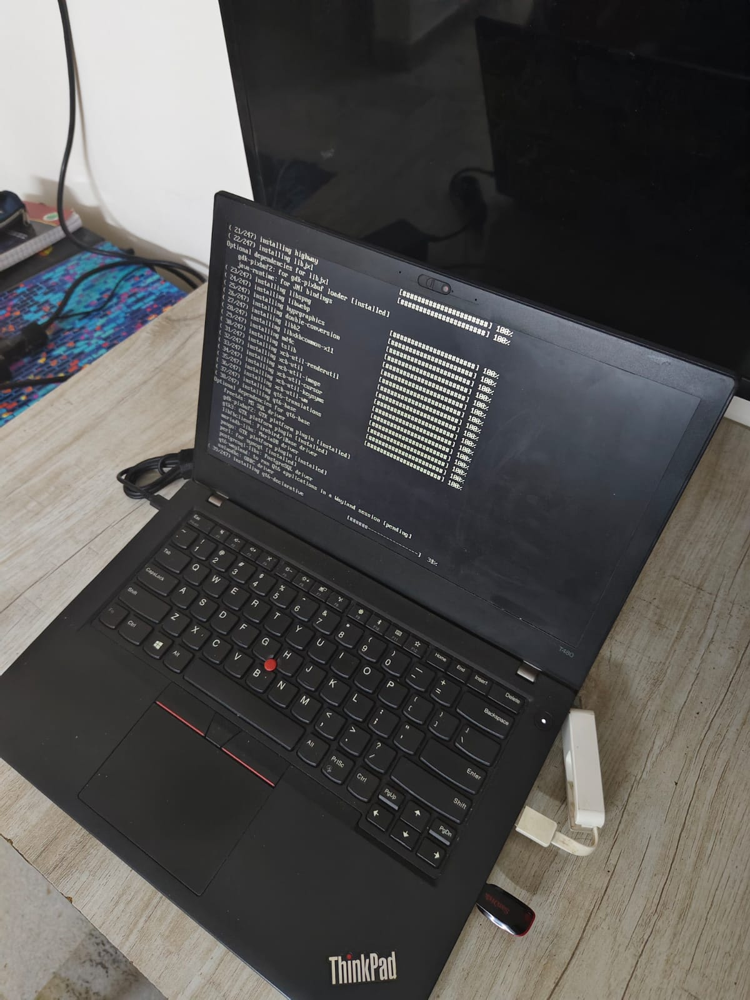

# 🏠 Homelab

An infrastructure-as-code repository for my personal homelab.

Currently, this repository manages one server: `think-server`, a ThinkPad T480 running Ubuntu Server. The configuration is managed primarily through Ansible, with Kubernetes workloads running on k3s.

## 🏗️ Architecture

```text
                         Internet
                            │
                     Cloudflare Tunnel
                            │
                            ▼
                    ┌───────────────┐
                    │  think-server │
                    │  192.168.1.10 │
                    └───────┬───────┘
                            │
                     ┌──────▼──────┐
                     │    k3s      │
                     │  Kubernetes │
                     └──────┬──────┘
                            │
                     ┌──────▼──────┐
                     │   Traefik   │
                     │   Ingress   │
                     └──────┬──────┘
                            │
              ┌─────────────┴─────────────┐
              │                           │
              ▼                           ▼
     judge.namanarora.xyz       argocd.namanarora.xyz
              │                           │
              ▼                           ▼
       Online Judge                    Argo CD
          `oj`                         `argocd`
```

Private administration is handled through Tailscale SSH.

## ⚙️ Hardware



## Services

| Service                   | Purpose                        | Access           |         Port |
| ------------------------- | ------------------------------ | ---------------- | -----------: |
| **Homarr**                | Homelab dashboard              | LAN / Cloudflare |       `7575` |
| **Portainer**             | Docker management              | LAN              |       `9443` |
| **Jellyfin**              | Media server                   | LAN / Cloudflare |       `8096` |
| **Immich**                | Photo management               | LAN / Cloudflare |       `2283` |
| **Argo CD**               | GitOps / Kubernetes management | Cloudflare       | `80` / `443` |
| **Online Judge**          | Online coding judge            | Cloudflare       | `80` / `443` |
| **Samba**                 | Network file sharing           | LAN              |        `445` |
| **Tailscale**             | Private remote access          | Tailscale        |            — |
| **Cloudflared**           | Cloudflare Tunnel              | Outbound         |            — |
| **k3s**                   | Kubernetes cluster             | LAN              |       `6443` |
| **Traefik**               | Kubernetes ingress             | LAN / Cloudflare | `80` / `443` |
| **GitHub Actions Runner** | CI/CD runner                   | Outbound         |            — |

### Online Judge — Kubernetes Services

| Service             | Kubernetes Port | Type      |
| ------------------- | --------------: | --------- |
| API Gateway         |          `5000` | NodePort  |
| Auth Service        |          `5002` | ClusterIP |
| Users Service       |          `5001` | ClusterIP |
| Problems Service    |          `5003` | ClusterIP |
| Tags Service        |          `5004` | ClusterIP |
| Companies Service   |          `5005` | ClusterIP |
| Submissions Service |          `5006` | ClusterIP |
| Execution Service   |  `5007`, `9007` | ClusterIP |
| PostgreSQL          |          `5432` | ClusterIP |
| Redis               |          `6379` | ClusterIP |
| Frontend            |          `3000` | NodePort  |

## Server

| Property           | Value               |
| ------------------ | ------------------- |
| Hostname           | `think-server`      |
| Hardware           | ThinkPad T480       |
| OS                 | Ubuntu Server 26.04 |
| Kubernetes         | k3s                 |
| Kubernetes version | `v1.36.5+k3s1`      |
| Configuration      | Ansible             |

The server is intended to be managed through Ansible rather than manually configured wherever practical.

## Repository Structure

```text
.
├── ansible
│   ├── ansible.cfg
│   ├── requirements.yml
│   ├── inventory
│   │   ├── group_vars
│   │   │   └── all
│   │   │       └── vault.yml
│   │   ├── hosts.ini
│   │   ├── playbooks
│   │   │   └── think-server.yml
│   │   └── roles
│   │       ├── argocd
│   │       ├── cloudflared
│   │       ├── docker
│   │       ├── github_runner
│   │       ├── homarr
│   │       ├── immich
│   │       ├── jellyfin
│   │       ├── k3s
│   │       ├── portainer
│   │       ├── samba
│   │       ├── tailscale
│   │       └── ufw
└── README.md
```

Each service is separated into an Ansible role where practical.

Typical role structure:

```text
roles/<role>/
├── defaults/
│   └── main.yml
├── tasks/
│   └── main.yml
├── handlers/
│   └── main.yml
└── templates/
```

## Ansible

Run the complete server configuration with:

```bash
ansible-playbook playbooks/think-server.yml --ask-vault-pass
```

Secrets that need to be available to Ansible are stored in:

`group_vars/vault.yml`

The file is encrypted using Ansible Vault.

## UFW

The server uses UFW with a default-deny incoming policy.

Allowed traffic includes:

- SSH (22/tcp)
- Tailscale interface
- HTTP (80/tcp)
- HTTPS (443/tcp)
- LAN traffic from 192.168.1.0/24
- k3s API (6443/tcp) from LAN
- k3s supervisor (9345/tcp) from LAN
- k3s VXLAN (8472/udp) from LAN

The k3s-specific ports are intentionally restricted to the LAN rather than exposed publicly.

## Remote Access

### Tailscale

Tailscale provides private remote access to the server.

SSH can be performed through the Tailscale hostname:

```bash
ssh naman@think-server
```

Tailscale is also allowed through UFW using the tailscale0 interface.

### Cloudflare Tunnel

Cloudflare Tunnel is used for public-facing services.

The cloudflared service runs on think-server:

```bash
/usr/bin/cloudflared --no-autoupdate tunnel run --token-file /etc/cloudflared/token
```

Public services are routed through the local Traefik ingress.

Current hostnames discussed in this setup:

- judge.namanarora.xyz
- api-judge.namanarora.xyz
- argocd.namanarora.xyz

The Cloudflare Tunnel avoids directly exposing the server's public IP.

## Kubernetes

### k3s

The server runs a single-node k3s cluster.

```text
think-server
└── k3s
    ├── Traefik
    ├── Online Judge
    └── Argo CD
```

The node is configured as the control-plane node.

Kubernetes access is available to the naman user without requiring sudo:

```bash
kubectl get nodes
```

### Traefik

Traefik is the ingress controller provided by the k3s installation.

It receives traffic on:

- 80
- 443

The Online Judge and Argo CD services are routed through Traefik.

## Online Judge

The main Kubernetes workload is my Online Judge Platform.

Repository: https://github.com/naman22a/online-judge-platform

It runs in the: `oj` namespace.

### Services

The deployment contains the following backend services:

- api-gateway
- auth-service
- users-service
- problems-service
- tags-service
- companies-service
- submissions-service
- execution-service

along with:

- PostgreSQL
- Redis
- React client

The frontend is available at: https://judge.namanarora.xyz

The API is exposed at: https://api-judge.namanarora.xyz

### Execution

The execution service creates Kubernetes Jobs for submitted code.

Runner images currently include:

- gcc:15
- python:3.9
- node:18
- eclipse-temurin:17-jdk

Execution Jobs have resource limits and timeouts and run independently from the execution service.

## Docker

Docker is installed on think-server and is managed through Ansible.

Docker is used for the server-side container workloads and management tooling.

Portainer is also installed for Docker management.

## Portainer

Portainer CE is deployed using Docker Compose.

Relevant ports:

- 9443
- 8000

The Docker socket is made available to Portainer for Docker management.

## Storage / Media Services

The server also contains Ansible roles for:

- Samba
- Jellyfin
- Immich

These provide the homelab's NAS/media/photo functionality.

The Samba configuration uses credentials stored through Ansible Vault.

## Homarr

Homarr is included as a homelab dashboard.

It is intended to provide a central dashboard for the services running on the server.

## Argo CD

Argo CD is already installed inside the k3s cluster.

Namespace: `argocd`

Current components include:

- argocd-server
- argocd-repo-server
- argocd-application-controller
- argocd-applicationset-controller
- argocd-dex-server
- argocd-redis
- argocd-notifications-controller

The Argo CD server is exposed internally through:

- argocd-server:80
- argocd-server:443

For the external setup, TLS termination is handled by Traefik.

Argo CD is configured with: `server.insecure=true`

so that Traefik can terminate TLS.

The planned external hostname is: https://argocd.namanarora.xyz

Traffic flow:

```text
argocd.namanarora.xyz
        │
        ▼
Cloudflare Tunnel
        │
        ▼
Traefik
        │
        ▼
argocd-server:80
```

The Argo CD Traefik configuration is managed through the Ansible argocd role.

## GitHub Actions Runner

A self-hosted GitHub Actions runner runs directly on think-server.

Repository: `naman22a/online-judge-platform`

Runner: `think-server`

Labels:

- self-hosted
- linux
- x64
- think-server

The runner allows GitHub Actions to execute deployment tasks directly against the k3s cluster.

The runner is managed as a system service using GitHub's svc.sh.

The runner has access to:

- kubectl
- docker

as the naman user.

Because the runner has access to the homelab infrastructure, untrusted workflows should not be executed on it.

## GitOps

The intended deployment architecture is:

```text
Developer
    │
    ▼
GitHub
    │
    ▼
GitHub Actions
    │
    ├── Test
    ├── Build Docker images
    └── Push images
          │
          ▼
       Docker Hub
          │
          ▼
       Git / manifests
          │
          ▼
        Argo CD
          │
          ▼
         k3s
          │
          ▼
    Online Judge
```

The goal is for Argo CD to become the deployment authority for Kubernetes workloads, rather than having GitHub Actions directly modify Kubernetes deployments.

## Secrets

Sensitive values are kept out of normal Git configuration where possible.

Ansible secrets are stored in: `group_vars/vault.yml`

and encrypted using: `ansible-vault`

The Ansible Vault password itself is not stored in this repository.

Kubernetes secrets should likewise not be committed as plaintext credentials.

## Design Goals

This homelab is primarily a learning and portfolio project focused on:

- Linux administration
- Ansible
- Docker
- Kubernetes
- k3s
- Traefik
- GitHub Actions
- GitOps
- Argo CD
- Cloudflare Tunnel
- Tailscale
- Infrastructure as Code
- Self-hosted services

The goal is not to build a production-grade multi-node cluster. The infrastructure is intentionally centered around a single ThinkPad T480, making it inexpensive to experiment with real infrastructure concepts while keeping the configuration reproducible through code.
